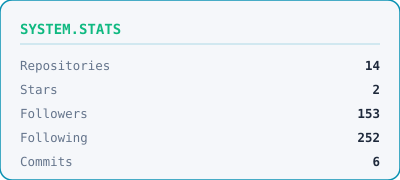
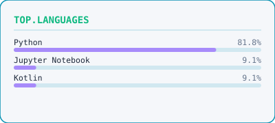
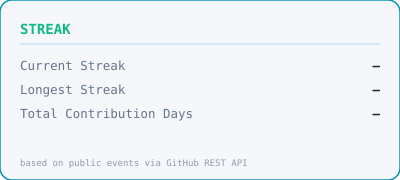

# aiMahdiX

**AI Engineer** — Computer Vision · LLMs · Model Behavior · Data Processing · Intelligent Systems

---

## 1 · Animated Banner

<picture>
  <source media="(prefers-color-scheme: dark)" srcset="./assets/banner-dark.svg">
  <source media="(prefers-color-scheme: light)" srcset="./assets/banner-light.svg">
  
</picture>

---

## 2 · GitHub Stats

  <picture>
    <source media="(prefers-color-scheme: dark)" srcset="./assets/stats.svg">
    <source media="(prefers-color-scheme: light)" srcset="./assets/stats-light.svg">
    
  </picture>
  &nbsp;&nbsp;
  <picture>
    <source media="(prefers-color-scheme: dark)" srcset="./assets/top-languages.svg">
    <source media="(prefers-color-scheme: light)" srcset="./assets/top-languages-light.svg">
    
  </picture>

  <picture>
    <source media="(prefers-color-scheme: dark)" srcset="./assets/streak.svg">
    <source media="(prefers-color-scheme: light)" srcset="./assets/streak-light.svg">
    
  </picture>

> **Note:** These cards are generated by a GitHub Action (`scripts/generate_stats.py`) using the official GitHub API. No rank is shown — GitHub's rank is star-weighted and can be misleading, particularly for smaller or newer accounts. Stats and Top Languages sit side-by-side; the streak card sits below.

---

## 3 · Contribution Snake

> The snake renders once the `Generate Contribution Snake` Action has run and the `output` branch exists. Enable **Repository Settings → Actions → General → Workflow permissions → Read and write permissions**, then run the workflow.

<picture>
  <source media="(prefers-color-scheme: dark)" srcset="https://raw.githubusercontent.com/aiMahdiX/aiMahdiX/output/github-contribution-grid-snake-dark.svg">
  <source media="(prefers-color-scheme: light)" srcset="https://raw.githubusercontent.com/aiMahdiX/aiMahdiX/output/github-contribution-grid-snake.svg">
  
</picture>

---

## 4 · Connect

  
  &nbsp;&nbsp;
  
  &nbsp;&nbsp;
  

---

*Hi, I'm Mehdi 🚀 AI engineer crafting computer-vision systems and smart tools 🤖 I work on LLM tuning, model behavior analysis, and heavy data processing 🔍📊*

